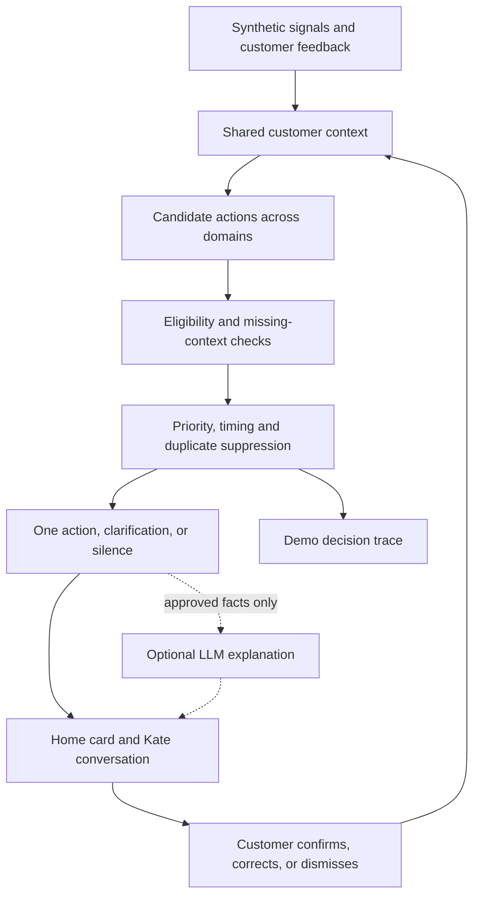

# Smart Stock — powered by a Moments Engine

**A proactive financial guidance concept for the Tectonic Hackathon, KBC track.**

Smart Stock helps customers decide what their money needs to do next. It combines known expenses, customer goals and changing life circumstances to identify a useful next step. When important context is missing, it asks one short question. When the customer's plans change, the recommendation changes with them.

Investing is our first use case. The proposed Moments Engine also coordinates saving and insurance journeys, keeps actions consistent across channels, and suppresses unnecessary nudges.

**Our vision:** a shared understanding of the customer that turns changing life context into timely, coordinated support across KBC. Smart Stock is our first demonstration.

**Our customer promise:** explain your situation once, correct it easily, and receive help that changes with your life. A decision to keep money available is a successful outcome too.

> **Rules decide. AI explains. Customers stay in control.**

**Current status:** this repository contains the concept, planning documents, shared TypeScript interfaces and six synthetic demo snapshots. The application and decision service have not been implemented yet. The flows below describe the intended MVP, not verified capabilities.

## The challenge: save time and money

KBC asks us to imagine that it could understand what customers want and need before they ask.

| Dimension | What our prototype should demonstrate |
|---|---|
| **Understand** | Distinguish observed signals from customer intent; ask for missing context when it changes the decision. |
| **Adapt** | Change the next action, amount, timing and interface when the customer's circumstances change. |
| **Scale** | Reuse context and decisions across products and channels, keeping action state consistent. |

The participant guide describes more than 2.3 million customers; the live briefing refers to 2.5 million. Our ambition is an approach for millions of customers. Production scale is not demonstrated by this prototype.

## Our answers to the five challenge questions

### 1. What signals can help us understand what customers need?

We propose combining financial facts, behavioural patterns and information the customer explicitly shares:

- **Financial situation:** accessible balances, known upcoming expenses, emergency reserves and existing commitments.
- **Behaviour over time:** recurring income and essential-spending patterns, using three months of synthetic summaries in the MVP.
- **Intent and life context:** a stated goal, its amount and deadline, or a confirmed plan such as moving home.
- **Feedback:** corrected assumptions, reported external coverage, dismissed actions and paused suggestions.

Each signal has a source, observation time and validity period. Observed facts, inferences and customer-confirmed information remain distinguishable. A large balance can justify asking about plans; it cannot establish a desire to invest. Missing information triggers clarification or deferral.

**Planned proof:** an evidence panel shows the inputs behind Lotte's €2,850 potentially available cash and identifies the missing information about her plans. The fixtures already include these inputs; evaluation and the panel remain to be built.

### 2. How can customers be recognized based on their situation, behavior, and intent?

We represent each customer's current context through three complementary views:

| View | What we understand | Example |
|---|---|---|
| **Situation** | Current resources, constraints and known commitments. | Lotte has €7,850, a €4,000 reserve and €1,000 of upcoming expenses. |
| **Behaviour** | Patterns that help identify when a question may be useful. | Three recurring income payments provide background, without guaranteeing future income. |
| **Intent** | What the customer says they want to achieve, and when. | Lotte confirms that she needs €2,500 for a move next month. |

The context changes as the customer's life changes. A current explicit correction overrides a conflicting inference. If a relevant answer is already current, the experience uses it rather than asking the customer to repeat it. “Recognized” here means understood in context; identity verification is outside the prototype.

**Planned proof:** the same Lotte fixture supports a near-term moving plan or a confirmed long-term goal. Those different intentions produce different next steps despite the same starting balance.

### 3. How can personalized experiences automatically adapt to each customer?

After an accepted context update, the engine recalculates available cash, checks candidate actions, and selects at most one primary next step. Adaptation changes the action, amount, explanation and timing. It can also remove a suggestion entirely.

For Lotte, adding a €2,500 moving commitment reduces potentially available cash from €2,850 to €350. The investment candidate becomes ineligible, and the interface prioritises reviewing the moving reserve. After she acknowledges that plan, a relevant coverage question can appear. Reporting existing insurance closes that question; pausing suggestions leaves ordinary navigation available without proactive prompts.

**Planned proof:** the UI updates from the returned shared snapshot after each event. Automatic adaptation does not execute a transaction: investment confirmation is an explicit simulation, and no money moves.

### 4. How can this work seamlessly across products, services, and channels?

Our proposed Moments Engine shares customer context and coordinates actions across cash planning, investment exploration and insurance coverage checks. Each product contributes relevant eligibility rules and a next step. A common coordinator handles priority, suppression and resolution so separate services do not repeatedly ask the same question or present conflicting suggestions.

Each action has a stable identity and a shared status. The home screen and Kate conversation read the same state: an answer entered in one is immediately reflected in the other. A customer correction becomes reusable context for subsequent decisions.

**Planned proof:** “I'm already insured elsewhere” resolves the coverage prompt on both surfaces while retaining its customer-reported provenance. These are two surfaces within one application. Connecting real notifications, advisers or other channels would require persistent state, appropriate access controls and delivery integrations beyond this MVP.

### 5. How can you create meaningful impact for millions of customers at the same time?

Our scale vision combines reusable processing with measurable customer value. Customer events would update the relevant context and trigger applicable rules. Deterministic filtering and action coordination would run before any optional AI explanation, allowing the core experience to operate without a model call for every customer or event. New domains would reuse that pipeline while supplying their own data, rules and completion journeys.

Meaningful impact means less decision effort, fewer repeated questions and fewer irrelevant interruptions. We would measure completion time, steps, customer corrections, duplicate prompts and consistency across surfaces. Keeping money available or respecting a dismissal counts as a useful outcome. A limited pilot would establish a baseline and review errors and customer feedback before wider rollout, including customers with incomplete data or changing income.

**Planned proof:** shared interfaces, six synthetic snapshots and five expected transitions define the reusable mechanism. A working engine trace would demonstrate its decisions; an optional synthetic benchmark could measure local processing cost. Neither proves production throughput or improved customer trust. Those require a deployed pilot and further validation.

### How this strengthens the relationship between KBC and its customers

The customer can see what KBC believes, correct it, and see that correction respected throughout the journey. Withdrawing an investment candidate when a moving expense appears demonstrates attention to the customer's immediate needs. Remembering an existing-coverage answer reduces repeated explanations. Giving the customer control over suggestions makes the relationship easier to manage.

Smart Stock is the first use case of this broader vision: **a bank that maintains a shared, customer-correctable understanding and uses it to offer timely, coordinated support as life changes.** The proof of concept must demonstrate those state changes end to end; the expected relationship benefits remain hypotheses to evaluate.

### Signals, behaviour and intent

| Input | What it can tell us | What it cannot establish |
|---|---|---|
| Accessible balance and known commitments | Current liquidity under stated assumptions. | That the remaining money is unwanted or investable. |
| Three months of synthetic income and essential-spending totals | An illustrative recurring pattern or a change worth checking. | Guaranteed future income or a complete view of other accounts. |
| A customer-confirmed goal, amount and date | A stated intention and funding deadline. | That the intention never changes. |
| An address-change event | A possible life transition. | A missing insurance policy or an intention to buy one. |
| A dismissal or explicit correction | Whether this action is wanted or based on an incorrect assumption. | A permanent preference across every unrelated service. |

Each signal should carry its source, observation time and whether it is observed, inferred or customer-confirmed. The MVP uses readable evidence labels rather than invented confidence percentages. Current explicit corrections override conflicting inferences; stale or conflicting facts require clarification. Use a fixed demo date so fixtures do not change meaning overnight.

The synthetic history is supporting evidence, not a predictive model. The demo uses no sensitive life-event inference from merchant names or personal communications.

## The problem

A balance does not explain what the money is for. The same balance could represent a long-term opportunity, a moving deposit, or a reserve for uncertain income.

Customers must connect those facts themselves, navigate separate products and repeatedly explain their situation. A premature investment suggestion or an unnecessary insurance offer adds work and weakens trust.

Our target customer has some savings and wants help deciding what to do next while keeping enough flexibility for everyday life. The experience should reduce both decision effort and irrelevant interruptions.

## What makes the idea different

KBC already offers [automated personal investment proposals](https://www.kbc.be/retail/en/products/payments/self-banking/on-your-smartphone/mobile/mobile-faq/investments.html), and [Kate already provides proactive assistance](https://newsroom.kbc.com/kate--vijf-jaar-vijf-mijlpalen).

Our proposed contribution is a decision layer that:

- Treats a signal as a hypothesis until the relevant intent is known.
- Changes its recommendation when the customer corrects that hypothesis.
- Coordinates competing actions and highlights at most one useful next step.
- Remembers completion, dismissal and corrections across the home screen and Kate conversation.
- Can remain quiet, with the reason visible in the demo's engine view.

## Main demo: same customer, same balance, new context

Lotte has a synthetic balance of **€7,850**. Initially, the engine knows about a **€4,000 emergency reserve** and **€1,000 of upcoming expenses**.

| Calculation | Amount |
|---|---:|
| Accessible cash | €7,850 |
| Emergency reserve | − €4,000 |
| Upcoming expenses | − €1,000 |
| **Potentially available, based on known information** | **€2,850** |

Kate displays a quiet home-screen card:

> “Based on your known expenses and reserves, you may have €2,850 available to plan with. Do you have any other large expenses coming up?”

Quick replies: **No upcoming plans** · **I'm moving** · **Something else**.

If an explicit, current customer goal already answers the question, the engine should use it instead of asking again. A balance alone does not establish investment intent.

### Path A: explore a long-term opportunity

Lotte confirms that she has no additional near-term commitments and wants to explore a long-term goal. If the demo eligibility checks pass, Kate offers an adjustable **€1,500 investment simulation**, explaining the calculation and assumptions.

The amount follows an illustrative demo policy: take 50% of €2,850, round to the nearest €500, and cap at the available amount. This heuristic does not establish suitability or guarantee safety.

Lotte reviews the scenario and chooses **Confirm simulation**. No money moves.

### Path B: her plans change

Using the same initial customer, Lotte selects **I'm moving** and confirms that she needs **€2,500 next month**. This is an additional commitment, not already included in the upcoming expenses.

```text
€7,850 − €4,000 reserve − €1,000 expenses − €2,500 moving commitment
= €350 potentially available
```

The investment suggestion disappears. Kate shows the updated reserve plan and explains why the recommendation changed.

If Lotte's insurance situation is unknown, the next relevant action can be **Check my existing cover**. A missing KBC policy does not mean she is uninsured. Coverage has three states: **confirmed covered**, **confirmed need**, and **unknown**.

Lotte answers **I'm already insured elsewhere**. The prompt closes on both the home screen and the Kate conversation. Her correction is retained for the demo session and labelled as customer-provided information, not independently verified policy coverage.

**The key demo moment:** the customer adds one fact, and the experience immediately changes.

### Why this strengthens the relationship

Lotte can see what KBC believes, correct it and see the correction respected elsewhere. Withdrawing the investment suggestion demonstrates that retaining liquidity can take priority over selling a product. Remembering her answer avoids making her repeat herself.

The planned **What Kate knows** panel shows the current goal, its source and date, and lets the customer edit or clear customer-provided context. Clearing context returns it to unknown; pausing suggestions suppresses proactive actions while leaving ordinary navigation available. MVP memory lasts only for the current app session. Persistent, permission-aware memory is part of the production vision.

## MVP experience

| Surface | Customer experience |
|---|---|
| **Home** | At most one primary action, or no nudge when none is useful. |
| **Context and intent** | A short calculation, known assumptions and a relevant clarification when needed. |
| **Next step** | Keep funds flexible, reserve for a near-term goal, or explore an eligible investment simulation. |
| **Review and confirmation** | Adjustable amount, reasons and explicit simulated confirmation. |
| **Kate conversation** | The same action and status as the home screen. |
| **Engine view** | Demo-only view of signals, selected action, suppressed candidates and reasons. |

Investment scenarios appear after the intent check. Their labels are **Lower risk**, **Balanced** and **Growth**; lower risk does not mean risk-free. The prototype considers the stated goal, horizon, liquidity needs and completeness of the synthetic investment profile alongside risk tolerance. Missing required information leads to clarification or deferral.

These scenarios do not replace KBC's suitability process. See [KBC's investment profile description](https://www.kbc.be/retail/en/investments/investment-profile.html?zone=topnav).

## Proposed architecture



### Context and cash calculation

```text
Potentially available cash = max(0,
  accessible cash
  − emergency reserve
  − upcoming expenses
  − additional near-term goal commitments
)
```

Identify which money is accessible and count each expense or commitment only once. Include ordinary living costs in expense assumptions. Missing or stale data must not be treated as zero spending or proof of spare cash.

The example reserve is a synthetic customer setting. Amounts and thresholds are demo assumptions, not universal financial guidance. No return or inflation-beating outcome is promised.

### Action coordination

- Highlight at most one primary action at a time.
- Prioritise known near-term funding needs over investment opportunities.
- Ask a short question when missing context could change the outcome.
- Suppress completed and dismissed actions for the applicable scenario; reassess when context materially changes.
- Keep non-urgent opportunities in the app rather than automatically sending a push notification.
- Record why each candidate was selected, deferred or suppressed.

### Customer control and AI boundaries

The customer can correct a goal, adjust an amount, dismiss an action or pause proactive suggestions. Confirmation is explicit and simulated.

The optional LLM rewrites approved facts in plain language. It must not invent customer facts, alter amounts or eligibility, or add return promises. Templates provide the baseline experience and fallback. The core demo should work without an API key.

## Showing reuse and scale

The MVP will demonstrate investment exploration, a moving reserve and an insurance coverage check using shared context. The home screen and Kate conversation will reference the same action ID and state: resolving an action in one surface updates the other.

This demonstrates reuse within one prototype. Adding a product still requires relevant data, eligibility rules and a completion journey.

For a production direction, customer events would update relevant context and trigger applicable rules. Deterministic filtering would precede optional explanation calls. Persisted action state, channel delivery, permissions, monitoring and load validation remain future work.

An optional synthetic batch benchmark can report evaluation count and elapsed time with its environment and limitations. It must not imply verified million-customer throughput.

Meaningful scale also requires consistent treatment of customers with incomplete data, changing income or paused suggestions. Planned scenario checks cover those cases. A future rollout would start with a limited pilot, compare decision effort and irrelevant-prompt rates against a defined baseline, and expand only after reviewing customer feedback and errors. Product conversion alone is not the success measure.

## Demo script: under three minutes

1. **Understand:** show Lotte's balance, commitments and missing-context question.
2. **Adapt:** add the €2,500 moving plan; show the recalculation and withdrawal of the investment suggestion.
3. **Coordinate:** record “already insured elsewhere” and show the coverage prompt closing on both surfaces.
4. **Explain:** open the engine trace to show why candidates were selected or suppressed.
5. **Optional alternate path:** reset the synthetic scenario and show the investment simulation for the confirmed long-term goal.

If time is tight, prioritise the context correction, suppressed investment suggestion and shared action state. Record a successful run as a demo backup.

## Measuring value

| Measure | Evidence to collect |
|---|---|
| Decision effort | Observed time and steps to complete the simulated journey. |
| Adaptation | Whether the expected action changes after a customer correction. |
| Unnecessary interruptions | Count and reasons for suppressed or duplicate candidates. |
| Channel consistency | Whether completion and dismissal appear on both surfaces. |
| Repeated explanation | Whether a customer must supply the same still-current fact again in the same journey. |
| Customer control | Whether correction, clearing context and pausing suggestions produce the expected state changes. |

No user-study results, time savings or financial benefits have been measured yet. Any later comparison should state its baseline, sample and method.

## Planned stack and status

- **Next.js + TypeScript** for one web application.
- **Tailwind CSS** with KBC-inspired tokens; see [design research](docs/DESIGN.md).
- **Synthetic typed fixtures** and a deterministic TypeScript decision engine.
- **Session-local state** shared by home and Kate views for the MVP.
- **Optional LLM explanations** with template fallback.

| Deliverable | Status |
|---|---|
| Product concept and repository instructions | Documented |
| Shared interfaces and six unified synthetic snapshots | Available in `lib/types.ts` and `data/demo-fixtures.ts` |
| Cash-context calculation and decision service | Planned |
| Intent clarification and recommendation changes | Planned |
| Candidate priority and suppression trace | Planned |
| Shared action state across home and Kate | Planned |
| Investment simulation and confirmation | Planned |
| Template explanations and optional LLM integration | Planned |
| Aikido audit and before/after screenshots | Not completed |

**Out of scope:** real banking data or APIs, payments or trading, real authentication, a production suitability process, stock prediction, portfolio optimisation, databases, native apps, multi-agent infrastructure and production-scale deployment.

## Parallel development contract

Frontend and core logic share [`lib/types.ts`](lib/types.ts) and [`data/demo-fixtures.ts`](data/demo-fixtures.ts). Read [`docs/CONTRACT.md`](docs/CONTRACT.md) for the async service boundary, customer events, error handling and ownership.

Frontend can render `getDemoSnapshot('initial')` immediately. The main snapshots progress through `initial → moving → coverage-check → covered`; the alternate path is `initial → investing → invested`. Amounts use EUR integer cents. Core logic implements the same `MomentsService` interface and reproduces the typed sample transitions. A shared UI provider keeps home and Kate consistent.

The fixtures are synthetic expected results, not evidence that the decision engine has been implemented.

## Running the project

There is currently no runnable app, package manifest or `.env.example` in this repository. Installation and start commands will be added and verified when the Next.js scaffold exists.

The planned optional environment variable is `ANTHROPIC_API_KEY`, for explanation text only. If implemented, keep it server-side in a gitignored `.env` file and document its name in `.env.example`. Template explanations must work without it.

## Security and submission

The participant guide requires an **Aikido security audit**, worth **10% of the submission assessment**, with screenshots **before and after remediation**. These are submission requirements, not completed checks.

Planned controls include synthetic data only, no committed secrets, validated inputs to decision logic, and separation between rule outputs and generated explanations. Deterministic logic still requires verification; it does not by itself establish security.

| Judging criterion | Intended evidence |
|---|---|
| **Creativity** | Customer corrections change the journey; coordinated actions reduce unnecessary prompts. |
| **Technical ability** | Working context updates, rule decisions and shared action state. |
| **Fit** | A visible Understand → Adapt → Scale story tied to saving time and money. |
| **Security** | Synthetic data, protected secrets and audit remediation evidence. |

- [ ] Short project description submitted through Builderbase.
- [ ] Accessible demo video under three minutes.
- [ ] Public GitHub repository accessible until judging finishes.
- [ ] Aikido baseline audit and screenshot.
- [ ] Findings addressed and final audit screenshot captured.
- [ ] Verified run instructions and an accurate list of unfinished functionality.
- [ ] Submission links checked and final version fixed before submission.

## Repository guide

- [AGENTS.md](AGENTS.md): coding-agent instructions.
- [docs/CHALLENGE.md](docs/CHALLENGE.md): challenge analysis and selected approach.
- [docs/PLAN.md](docs/PLAN.md): MVP implementation plan, contracts and acceptance scenarios.
- [docs/CONTRACT.md](docs/CONTRACT.md): canonical interface semantics and shared examples.
- [docs/DESIGN.md](docs/DESIGN.md): KBC-inspired design research.
- [Shared skills](https://github.com/ShayChen817/Pirates0fLeuven/tree/skills/skills): workflows on the `skills` branch.

This README defines the product direction. The challenge summary and implementation plan translate it into a bounded MVP; all application capabilities remain planned until implemented and verified.

---

Hackathon concept and planned proof of concept. Not affiliated with or endorsed by KBC. All demo customer data must be synthetic. No real transaction is executed, and illustrative scenarios are not financial advice.
