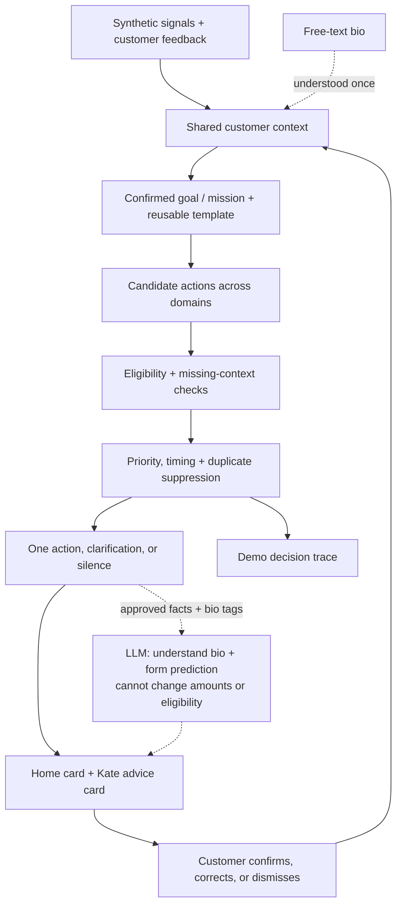

# Smart Stock — Life Goals, powered by the Moments Engine

**A proactive financial guidance concept for the Tectonic Hackathon, KBC track.**

> Set a goal. Kate helps you reach it faster — by spending smarter and putting idle cash to work — and tells you the moment it matters, or stays quiet when it doesn't.

This document proposes a **direction shift**: make the **customer's own life goal the hero** of the experience, and treat every KBC product as a *lever* that helps reach it. It builds directly on the team's existing **Moments Engine** and **Life Missions** work (`lib/types.ts`, `docs/CONTRACT.md`, `data/demo-fixtures.ts`) — it does not replace them. The **Moving mission** remains a first-class example; this proposal adds a **Saving mission** and a **spend-pattern ("leak") signal** alongside it.

> **Rules decide. AI explains. Customers stay in control.**

**Status:** proposal for team review. The repository contains concept and planning documents, shared TypeScript interfaces and six synthetic snapshots. The application and decision service are not implemented yet. Everything below describes intended behaviour, not verified capability.

---

## The shift, in one line

The current README leads with *life events* (moving, baby, business). This proposal reframes the same engine around the customer's **explicit goal** ("€2,000 for Japan by August"), and shows Kate closing the gap to that goal with two levers:

| Lever | What Kate does | Signal it runs on |
|---|---|---|
| ✂️ **Spend smarter** | Spot a recurring or above-average spend — in shops, **online, or as subscriptions** — and suggest one concrete, optional swap to a **cheaper or better** alternative that frees cash toward the goal. | Recurring-merchant / category-outlier / duplicate-subscription pattern in synthetic transactions (physical **and** online). |
| 📈 **Invest idle cash** | Offer an adjustable investment simulation when there is genuinely spare cash and the goal horizon fits. | The existing `explore-investment` rule / idle-cash detection. |

Goals come in two kinds, both **explicitly set by the customer**:

- **Financial goals** — "€2,000 for Japan by August", "drop unused subscriptions".
- **Opt-in lifestyle goals** — "eat healthier", "buy more sustainably". Kate helps with these *only when the customer chooses them*; it never infers a lifestyle or health goal from spending data (see the red line below).

A **Life Mission** is then just a *kind of goal*: **Moving** is a near-term spending/planning goal; **"Save €2,000 for Japan"** is a savings goal; **"eat healthier"** is an opt-in lifestyle goal. All are instantiated from the same Moments Engine, the same context, the same `Snapshot`/`Action` contract.

## Why this fits the brief better

KBC asked us to *"save time and money"* and to *not think like a bank*. Leading with the customer's goal — instead of a product or even a life event — makes the value emotionally obvious: **you chose the target; Kate just gets you there sooner.** Investing and cutting leaks stop sounding like product pushes and become means to *your* end.

| Dimension | How this proposal demonstrates it |
|---|---|
| **Understand** | Combine the confirmed goal + spending patterns to see not just *how much* cash is spare, but *what it's for* and *where it's leaking*. |
| **Adapt** | The single next action changes with the goal and the month's spending — and disappears entirely when a bill is due or the buffer is thin. |
| **Scale** | "Saving toward a goal" is one reusable mission template; "Moving" is another. New missions reuse the same pipeline with their own rules. |

---

## Kate as a consent-based buddy

The intent is that Kate feels like **a buddy who's on your side**, not a bank pushing products. That means suggesting the *cheaper or better* option toward whatever the customer is trying to do — across physical shops, online stores and subscriptions.

Two guardrails keep "buddy" from becoming "surveillance":

- **Cheaper is always fair game; "better/healthier" is opt-in only.** Kate suggests a healthier or more sustainable alternative **only** when the customer has explicitly set that goal. It never infers the goal.
- **The red line (shared with the team's existing README):** *do not infer pregnancy, health, religion or other sensitive characteristics from shopping or location history.* A buddy helps with the goals you told it about; it does not diagnose you from your groceries.

**Online and subscriptions are the cleanest signal — lead with them.** Recurring online charges and subscriptions are unambiguous (same merchant, same amount, monthly) and need no location or menu guessing. *"You have 3 streaming subscriptions totalling €38/month — dropping one reaches your Japan goal ~5 weeks sooner"* is a fully-mockable, high-impact demo moment, and a safer opener than the coffee example.

## How Kate thinks: you write, an LLM understands, rules decide the money

The customer keeps a **structured profile** (goal, amount, deadline, risk) **and a free-text bio** — they write, in their own words, who they are and what they want ("I'm a student in Leuven; I want to cut my coffee spending and save for Japan").

- **An LLM understands the bio.** When the bio is saved, an LLM reads it *once* and turns it into structured preferences and goal tags (e.g. `reduce:coffee`, `place:leuven`, `goal:travel-japan`). This runs at edit time, not on every screen.
- **Kate gives the prediction; the LLM helps form it.** Deterministic rules detect the candidate spending patterns and compute every *number* (cash freed, impact on the goal date, whether the emergency buffer stays safe). The LLM reads the understood bio + those detected patterns and **selects and explains the one suggestion that best matches what the customer asked for** — the "prediction" Kate surfaces.
- **Rules still decide the money.** The LLM never alters an amount, an eligibility decision, or moves money; it understands intent and phrases the prediction. This preserves the team's contract line: *deterministic filtering runs before any optional AI call; the model may not invent facts, change amounts or eligibility.*
- **No open chat.** The customer writes a bio and taps quick replies (Confirm / Not now / Why this?) — there is no free-form back-and-forth with Kate. Cost stays **low and bounded**: an LLM call when the bio changes and when a suggestion is composed, not per transaction and not a chatbot. Without an API key, the bio is matched by keyword and templates phrase the prediction, so the demo still runs.

**Security of the free-text bio:** the bio is the *only* customer text that reaches the model. It is treated as data; the model's output is constrained to preference tags and to choosing among rule-produced candidates; no model output can move money or change eligibility. So even a malicious bio cannot make Kate spend — at worst it yields an irrelevant suggestion the customer ignores. This is exactly the kind of boundary the required Aikido audit should verify.

## "Tell Once" is the customer's bio

Like a profile an assistant already knows without re-asking, the customer's durable facts — goal, amount, deadline, risk profile, "I'm already insured elsewhere", "I have a car", dietary preference — are recorded once and **reused across Home and Kate** (the team's existing **Tell Once** / **What Kate knows** panel and `CustomerContext`). Kate reads these structured fields directly; the free-text bio is understood by an LLM **once, when saved** (see below), not re-sent each turn — which keeps per-interaction cost low and keeps facts customer-correctable and auditable.

## You set the goals — Kate aligns to them

Suggestions are not chosen at random or pushed by the bank. The customer **explicitly sets their goals in the app** (a short onboarding, the way a banking app asks you to set one up), and can **tell Kate what they want** in their own words — e.g. *"cut my coffee spending in Leuven"* or *"I want cheaper coffee."* Those stated preferences become part of the Tell-Once bio.

Kate then only surfaces a leak or swap when it **aligns with a stated goal or preference.** If the customer said they want to cut coffee spending, Kate surfaces the *coffee* pattern and a cheaper option — not an unrelated one. The customer is in the driver's seat: they name the target, and Kate guides them toward it. Every card can show *why this* — which goal/preference it matches and which transactions triggered it. This keeps the experience a **buddy helping with the customer's own aims**, never surveillance.

---

## The Saving mission (new)

A customer sets a goal. Kate maintains a plan toward it and, when helpful, suggests **one** optional next step.

1. **Set the goal (explicitly, in the app).** A short onboarding asks the customer what they want: a money goal ("€2,000 for Japan by August") and, in their own words, what to help with ("cut my coffee spending in Leuven"). Recorded once as intent + amount + deadline + stated preferences, and reused everywhere.
2. **Detect a leak (deterministic).** Over 90 days of synthetic transactions — **physical, online and subscriptions** — a rule flags a recurring charge, a duplicate/overlapping subscription, or an above-category-average spend. E.g. *"3 streaming subscriptions = €38/month"* or *"coffee at MadMum, €4.20 × ~22/month = ~€92/month."* Each flag carries its evidence (which transactions, which rule).
3. **Suggest one swap.** Kate proposes a single, optional, respectful alternative — **cheaper, or (for an opt-in lifestyle goal) better/healthier** — with the projected impact: *"Dropping one overlapping subscription frees €13/month — your goal ~5 weeks sooner"* or *"a healthier own-brand swap here is also ~€2 cheaper."*
4. **Customer decides.** Confirm (track it as a saving intention), Not now, or Why this? Nothing is automated; no money moves.
5. **Progress updates.** The goal's progress bar and expected completion date reflect confirmed savings and any idle-cash investment.

### On price comparison — honest scope

**Online and subscription swaps need no external data at all** — the leak, the overlap and the saving are all computable from the customer's own transactions, so those are both the safest and the most demoable. The harder case is *physical* price comparison ("where is coffee/groceries cheaper" via Google Maps menus, Albert Heijn prices, image recognition). Taken literally that's a **hackathon trap**: scraping Google Maps is against its terms, isn't buildable in the time we have, and re-introduces exactly the AI-black-box risk we're avoiding. For the demo, **physical price alternatives are synthetic fixtures** (clearly labelled), while the *swap logic* — detect pattern → compare to a benchmark → project goal impact — is the real, deterministic contribution. Real external price feeds are future work requiring proper data access and customer consent, consistent with the team's stance on purchase/location signals.

## Example — Lotte's Japan goal

| | |
|---|---:|
| Goal | €2,000 by August |
| Saved so far | €650 |
| Gap | €1,350 |
| Detected leak (online, synthetic) | 3 streaming subs = ~€38/mo; 2 overlap |
| Detected leak (physical, synthetic) | Coffee ~€92/mo vs ~€24 usual |
| If confirmed swaps | +~€81/mo → **goal ~1 month sooner** |
| Idle cash available to invest | see existing `investing` fixture (€1,500 adjustable) |

Kate shows **one** card at a time — the swap *or* the investment, whichever moves the goal most right now — never both at once, and neither if a bill is due or the buffer is thin.

---

## Architecture — reuses the Moments Engine

The pipeline is unchanged. This proposal adds:

- a **`saving` action domain** alongside `planning | investing | insurance`;
- a **leak-detection rule** (e.g. `spend-pattern`) producing a `saving`-domain candidate with evidence IDs;
- a **goal-progress** view over confirmed savings + simulated investment.

### Contract impact

This is **additive** and does **not** break contract v1.0. `Action.domain` would gain `'saving'`; a new `RuleId` and `ReasonCode`s would be added; new fixtures (`saving-*`) would be introduced. Per `docs/CONTRACT.md`, any such change must be agreed with the core-engine owner and land in `lib/types.ts`, the golden fixtures and `docs/CONTRACT.md` **together**, announced in the commit. **Nothing here changes the existing Moving/investment fixtures a teammate is already building against.**

---

## Status

| Item | Status |
|---|---|
| Goals-as-hero framing + Saving mission + consent-based buddy | Proposed (this document) |
| Online/subscription leak signals | Proposed; fully mockable, no external data needed |
| Opt-in lifestyle goals (e.g. "eat healthier") | Proposed; customer-set only, never inferred |
| LLM bio understanding + aligned prediction | Proposed; bounded cost, money stays rule-decided, template fallback |
| Moments Engine, Life Missions, Moving mission | Documented by team; unchanged |
| Shared interfaces + six synthetic snapshots | Available in `lib/types.ts`, `data/demo-fixtures.ts` |
| `saving` domain + leak-detection rule + fixtures | Proposed; contract extension not yet agreed |
| Decision service, UI, LLM rephrase | Planned (as in existing README) |
| Real external price feeds | Future; requires data access + consent |
| Aikido audit + before/after screenshots | Not completed |

**Out of scope:** real banking data or APIs, payments or trading, real authentication, a production suitability process, live web scraping, databases, native apps, and production-scale deployment.

## Security and submission

Unchanged from the team's plan: synthetic data only, no committed secrets, deterministic logic separated from generated explanations, and a required **Aikido audit** (10% of assessment) with before/after screenshots. The **free-text bio is the only customer text that reaches the model**; it is treated as data, the model's output is constrained to preference tags and to selecting among rule-produced candidates, and **no model output can move money or change eligibility**. There is no open chat, so the attack surface is one bounded input, not a conversation — a boundary the Aikido audit should explicitly verify.

## Repository guide

- [AGENTS.md](AGENTS.md): coding-agent instructions.
- [docs/CHALLENGE.md](docs/CHALLENGE.md): challenge analysis.
- [docs/PLAN.md](docs/PLAN.md): MVP implementation plan.
- [docs/CONTRACT.md](docs/CONTRACT.md): canonical interface semantics.
- [docs/DESIGN.md](docs/DESIGN.md): KBC-inspired design research.

---

Hackathon concept and proposed proof of concept. Not affiliated with or endorsed by KBC. All demo customer data is synthetic. No real transaction is executed, and illustrative scenarios are not financial advice.
