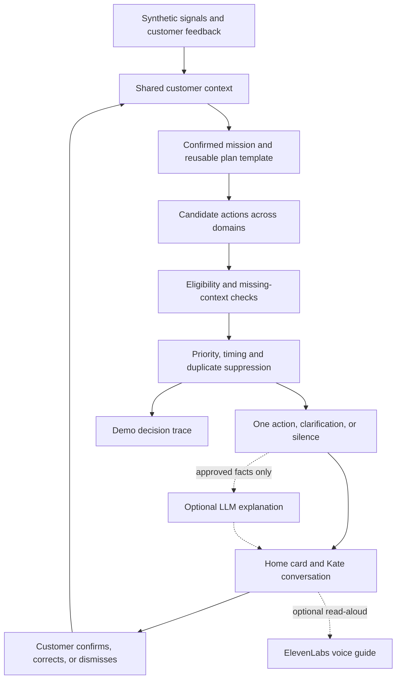

# Smart Stock — Life Goals, powered by the Moments Engine

**A proactive financial guidance concept for the Tectonic Hackathon, KBC track.**

> **Set a goal. Kate helps you plan the next useful step, spend more intentionally and keep your progress in view.**

The customer's own goal is the centre of the experience: save for a trip, prepare a move, buy a first home or start a business. **Life Missions** turn that goal into a shared, step-by-step plan. **Saving** adds spending reviews and goal projections; **Moving** connects cash planning, existing insurance coverage and information the customer should only need to provide once.

This direction integrates the team's [goals-saving-direction proposal at bc3cf2f](https://github.com/ShayChen817/Pirates0fLeuven/blob/bc3cf2f/README.md) with the existing mission, signal and shared-state design. Moving retains its six v1 fixtures; Saving is the next contract extension, not an already implemented capability.

The **Moments Engine** supplies the context, rules and next actions behind each mission. Smart Stock's original investment exploration becomes one possible action when it fits the customer's goal. **Tell Once** becomes a reusable step within the Moving mission: confirm relevant information once and reuse it throughout the journey.

The next step in that vision is **understanding patterns across purchases, places and plans**. With appropriate data access and customer controls, Kate could connect recent spending with relevant location context to suggest a useful mission before the customer searches for help. The customer can see the evidence and correct the interpretation.

## Goals first: the Saving mission

Home leads with **your goal, saved amount, remaining gap, deadline and one useful Kate suggestion**. Products support the goal when appropriate. The same engine can suggest reviewing spending, retaining cash for a move or exploring a separate long-term investment scenario.

| Way to help | Example | Decision boundary |
|---|---|---|
| **Spend more intentionally** | Review recurring online or subscription charges and consider dropping one the customer no longer values. | A recurring payment is evidence of spending, not proof that a service is unused or redundant. |
| **Plan and reserve** | Allocate future contributions towards a trip or preserve liquidity for a move. | Keep existing obligations and the emergency reserve visible; do not double-allocate the same funds. |
| **Explore long-term investing** | Review the existing adjustable investment simulation for a separately confirmed long-term goal. | Do not fund a near-term travel target using assumed investment returns. |

### Example: Lotte's Japan goal

All values are synthetic. Use the fixed demo date **1 October 2026**, a deadline of **1 August 2027**, and contributions on the first of each month starting **1 November 2026**.

| Item | Value |
|---|---:|
| Target | €2,000 |
| Actually saved so far | €650 |
| Remaining gap | €1,350 |
| Existing monthly contribution plan | €125 |
| Subscription review candidates | €13 + €15 + €10 = €38/month |
| Potential saving if the customer drops the €13 service | €13/month |
| Revised planned contribution, if that saving is redirected | €138/month |
| Baseline completion | 11 contributions; 1 September 2027 |
| Revised projected completion | 10 contributions; 1 August 2027 |

The projection uses `ceil((target − saved) / monthly contribution)`, with zero interest and uninterrupted contributions. It is **one monthly contribution earlier under these assumptions**, not a guaranteed result. By the deadline, the baseline plan would total €1,900; the revised plan would total €2,030.

Kate first asks: **“You have three recurring streaming charges totalling €38/month. Is there one you no longer use?”** After Lotte identifies the synthetic €13 service, Kate can show: **“If you stop this charge and put that €13/month towards Japan, your projected finish changes from September to August.”**

The customer can **Add to my plan**, **Keep this service**, **Not now**, or inspect **Why this?** Accepting records a saving intention; it does not cancel a subscription, transfer money or increase the saved balance. The progress bar remains at **€650 / €2,000 (32.5%)**. Only separately recorded actual contributions change saved progress. A projected completion date can change immediately, clearly labelled as a projection.

This saving example is a separate scenario from the existing cash/investment fixtures. A future combined scenario must reserve goal-earmarked cash before computing any investable amount.

### Subscription, online and physical spending

Start with **online and subscription reviews**: repeated merchant/amount/date patterns are easy to demonstrate with synthetic records and do not require location. Customer confirmation establishes whether a charge can be stopped. Transactions alone cannot establish service usage, contractual overlap, cancellation eligibility or the cost of a competing product.

Physical shopping and coffee patterns can later support a spending review. A comparison should use an explicit customer budget or a clearly labelled synthetic benchmark. Specific cheaper alternatives require price information, matching product details and relevant terms; ordinary payment records rarely supply those details. External price feeds, receipt recognition and live scraping are outside this MVP.

### Kate as a customer-directed buddy

Kate supports the goals the customer chooses, with respectful suggestions rather than judgments about purchases. Financial goals such as saving for travel can drive optional spending reviews. Lifestyle preferences such as healthier or more sustainable choices are future, explicit opt-ins; they must never be inferred from purchases or location. No health diagnosis or sensitive-trait inference is part of this concept.

**Tell Once / What Kate knows** becomes an editable structured profile of current goals, preferences and confirmed facts. Each fact keeps its source and validity; only information relevant to the current purpose is used. Session memory is the MVP boundary, not a claim of durable cross-channel storage.

### Advice cards and quick replies

Kate's MVP interaction is a proactive advice card with structured forms and quick replies. The Kate view can show a guided history of the same cards, without an open-ended model chat. “Proactive” means relevant in-app help; it does not require push notifications.

The deterministic experience needs zero model calls. Optional wording or voice adds separate cost. Removing free-text model conversations reduces one attack surface, but does not eliminate prompt injection or other security issues: merchant labels, external data and generated content still require validation and appropriate handling.

Saving follows the existing one-primary-action policy. Bills and a thin reserve suppress inappropriate investment offers, but an optional expense review may still help. Rank actions by the confirmed goal, urgency and evidence rather than automatically hiding every suggestion or maximising product conversion.

**Our vision:** KBC, Kate and the customer's adviser work from the same evolving mission plan, helping the customer complete life goals with less repeated explanation and administration. The prototype focuses on the app and Kate; adviser integration is a future extension.

**Our customer promise:** explain your situation once, correct it easily, and receive help that changes with your life. A decision to keep money available is a successful outcome too.

> **Rules decide. AI explains. Customers stay in control.**

**Current status:** this repository contains the concept, planning documents, shared TypeScript interfaces and six synthetic demo snapshots. The application and decision service have not been implemented yet. The flows below describe the intended MVP, not verified capabilities.

## Life Missions: one goal, one shared plan

A mission groups the relevant tasks, information and services around a customer-confirmed life goal. Kate can suggest a possible mission from appropriate signals, or the customer can start one directly. A signal is a reason to ask; the customer confirms the mission before the experience reorganises around it.

| Mission | Customer goal | Illustrative coordinated support | Scope |
|---|---|---|---|
| **Saving** | Reach a customer-set amount by a chosen date. | Review recurring costs, record saving intentions and distinguish projected completion from actual progress. | Proposed second mission; contract extension pending. |
| **Moving** | Be ready for the move without overlooking money or coverage needs. | Confirm the plan once, reserve moving costs, check existing cover and track completed steps. | First planned demo. |
| **Buying a home** | Understand readiness and the next steps towards a purchase. | Deposit planning, financing preparation and coverage checks. | Reusable-template vision. |
| **Welcoming a baby** | Prepare household finances for a customer-declared family change. | Review the budget, savings goals and relevant existing cover. | Future, explicitly customer-initiated scenario. |
| **Starting a business** | Coordinate financial preparation for launching a business. | Separate personal reserves, business funding needs and setup tasks. | Reusable-template vision. |

The home screen would show **Your move**, its progress and one clear next action. Kate would guide the same plan in conversation, and a future adviser view would show the same confirmed facts and completed steps with appropriate access. Customers keep access to normal banking navigation and can edit or pause their mission.

### Tell Once inside the Moving mission

1. **Confirm the mission:** record the move, its date and expected cost.
2. **Plan the money:** account for the commitment and review the reserve.
3. **Check existing cover:** record what is already covered, including customer-reported external insurance.
4. **Reuse and review:** reflect each answer and completed step in both home and Kate, without asking again.

In this MVP, Tell Once means reusing the confirmed moving plan and coverage answer within the session. Updating an address at multiple organisations, contacting providers or submitting applications would require additional integrations and separate customer approval; those tasks are outside the current demo.

### Kate helps complete the next step

The vision includes preparing forms, coordinating follow-up and carrying out supported tasks after explicit approval. The prototype demonstrates recalculation, simulated plan acknowledgement and shared progress. It does not move money, purchase cover or send changes to outside organisations.

An optional **ElevenLabs voice guide** could read the next step and its explanation after the customer chooses to listen. The same text and buttons remain available, and voice failure must not block the journey. Voice is an optional presentation enhancement; speech recognition and voice-based transaction authorisation are outside this MVP.

## The challenge: save time and money

KBC asks us to imagine that it could understand what customers want and need before they ask.

| Dimension | What our prototype should demonstrate |
|---|---|
| **Understand** | Distinguish observed signals from customer intent; ask for missing context when it changes the decision. |
| **Adapt** | Change the next action, amount, timing and interface when the customer's circumstances change. |
| **Scale** | Reuse context and decisions across products and channels, keeping action state consistent. |

The participant guide describes more than 2.3 million customers; the live briefing refers to 2.5 million. Our ambition is an approach for millions of customers. Production scale is not demonstrated by this prototype.

## Our answers to the five challenge questions

### 1. What signals can help us understand what customers need?

We propose combining financial facts, behavioural patterns and information the customer explicitly shares:

- **Financial situation:** accessible balances, known upcoming expenses, emergency reserves and existing commitments.
- **Behaviour over time:** recurring income and essential-spending patterns, using three months of synthetic summaries in the MVP.
- **Purchase history:** transaction amount, date, merchant/category and recurring payments where available, to identify a change from the customer's usual activity. A payment record does not necessarily reveal individual purchased items.
- **Saving opportunities:** recurring online/subscription charges and spending against a customer-set budget can prompt a review linked to a stated goal. Ask whether the spending is still wanted before treating it as reducible.
- **Location context:** a customer-provided destination, available merchant location or optional city-level device context, with their origins kept distinct. A merchant's address is not proof of the customer's physical location.
- **Possible mission signals:** an explicit moving plan, address-change event or a clearly labelled synthetic moving-related transaction can prompt “Are you moving?” before activating a mission. Transaction-triggered mission detection is a planned extension; the current fixtures begin with a direct clarification.
- **Intent and life context:** a stated goal, its amount and deadline, or a confirmed plan such as moving home.
- **Feedback:** corrected assumptions, reported external coverage, dismissed actions and paused suggestions.

Each signal has a source, observation time and validity period. Observed facts, inferences and customer-confirmed information remain distinguishable. A large balance can justify asking about plans; it cannot establish a desire to invest. Missing information triggers clarification or deferral.

**Planned proof:** an evidence panel shows the inputs behind Lotte's €2,850 potentially available cash and identifies the missing information about her plans. The fixtures already include these inputs; evaluation and the panel remain to be built.

### Purchase history and location: turning signals into a useful question

**What is grounded in existing information:** KBC Mobile's developer-reported [App Store privacy disclosure](https://apps.apple.com/be/app/kbc-mobile/id458066754) lists purchase history and precise/coarse location under app functionality. This describes possible app data handling, not a public API or confirmation that Kate currently combines those fields to detect life events. KBC's [Kate FAQ](https://www.kbc.be/retail/en/products/payments/self-banking/on-your-smartphone/mobile/kbc-mobile-faqs/communicatie-contact-acties.html) describes optional proactive services and directs customers to its data protection statement.

**Our proposal:** use permitted, relevant inputs to build a small evidence timeline, suggest a possible mission and ask one useful confirmation question. This project has no access to real KBC purchase histories or device locations; all proposed examples below are synthetic.

| Signal source | What could help Kate understand | Example next step | Important interpretation limit |
|---|---|---|---|
| Recent transaction categories and merchant descriptions | Several related purchases may indicate preparation for a change. | Furniture and moving-service payments prompt a possible Moving mission. | A single furniture purchase could be a gift or routine replacement. |
| Recurring payments and changes over time | A new recurring obligation may affect future cash needs. | Ask whether a new rent or utility payment belongs in the moving budget. | A new payee alone does not prove a move or identify a household situation. |
| Available merchant city | Geographic context for a payment. | Use a known city as supporting context for a confirmed destination. | Online merchants and payment processors may be registered elsewhere. |
| Optional coarse device location | A recent, purpose-limited city context when the customer enables it. | Refine the destination question or, after confirmation, show relevant local support. | Being in Ghent does not mean living there; it could be a visit or commute. |
| In-app goal selection and explicit answers | A clear indication of what the customer wants. | Activate the Moving mission after confirmation; stop suggesting it after a correction. | Browsing a page is weaker evidence than explicitly selecting a goal. |

#### Concrete demo extension: “Are you preparing a move?”

1. **Show the timeline:** synthetic furniture and moving-service payments appear within a 14-day window. Optional city context indicates Ghent. Each item is labelled with its source and date.
2. **Form a hypothesis:** two distinct relevant transaction events qualify for a possible Moving mission under an explicit demo rule. Optional location can enrich the question but cannot trigger the mission by itself. This is a heuristic, not a trained prediction model.
3. **Ask with a reason:** “You have recent furniture and moving-service payments. Are you preparing a move? I can help you plan the remaining costs.” Replies: **Yes, I'm moving** · **Just shopping** · **Not now**. A **Why this suggestion?** panel shows only the inputs actually used.
4. **Confirm the missing facts:** if Lotte confirms, ask for the destination, date and remaining expected costs that are not already known. She confirms an additional €2,500. Then use the existing Moving journey: €2,850 potentially available becomes €350, and the home screen becomes **Your move**.
5. **Respect corrections:** **Just shopping** rejects the moving hypothesis without changing cash or creating a mission. **Not now** defers it. The proposed demo suppresses the same evidence bundle for 30 days; customer-initiated missions remain available.

The illustrative historical payments are already reflected in the €7,850 balance. They provide context and must not be deducted a second time. Only the confirmed additional €2,500 enters the future commitment calculation.

#### Personalisation controls that support this experience

The proposed signal layer checks allowed purpose, customer preferences and freshness before using an input. Optional device location is off by default for this use case, reduced to city level and expires after 24 hours in the demo policy. Those are design choices, not claims about KBC's current settings or retention rules. The mission still works through purchase signals or direct customer input when location is unavailable.

Customers can inspect **What Kate used**, disable optional location use, correct the suggested mission and pause proactive suggestions. Disabling a source removes derived hypotheses that depend on it; a separately confirmed customer goal can remain. Do not infer pregnancy, health, religion or other sensitive characteristics from shopping or location history. The baby mission remains customer-initiated.

**Build boundary:** this is a proposed extension before the current `initial` fixture. New purchase events, source preferences, mission hypotheses and rejection/snooze state need an agreed contract update. The six current snapshots do not contain those features, and this README does not claim they are implemented.

### 2. How can customers be recognized based on their situation, behavior, and intent?

We represent each customer's current context through complementary views:

| View | What we understand | Example |
|---|---|---|
| **Situation** | Current resources, constraints and known commitments. | Lotte has €7,850, a €4,000 reserve and €1,000 of upcoming expenses. |
| **Behaviour** | Patterns that help identify when a question may be useful. | Three recurring income payments provide background, without guaranteeing future income. |
| **Possible mission** | A tentative interpretation of permitted purchase and place signals. | Related moving-service and furniture payments suggest a question; a visit to Ghent alone does not establish a move. |
| **Intent** | What the customer says they want to achieve, and when. | Lotte confirms that she needs €2,500 for a move next month. |
| **Goal progress** | A target, deadline, actual saved amount and planned future contributions. | The Japan scenario has €650 saved towards €2,000; accepting a saving intention changes the projection, not the saved balance. |

The context changes as the customer's life changes. A current explicit correction overrides a conflicting inference. If a relevant answer is already current, the experience uses it rather than asking the customer to repeat it. “Recognized” here means understood in context; identity verification is outside the prototype.

For the proposed recognition extension, a mission progresses from **possible → customer-confirmed → active → completed**, or becomes **rejected / deferred**. Hypotheses never silently become confirmed facts. Signal expiry removes unsupported hypotheses; an explicit answer supplies its own provenance.

**Planned proof:** the same Lotte fixture supports a near-term Moving mission or a confirmed long-term goal. Those different intentions produce different next steps despite the same starting balance. Mission membership follows a confirmed goal and can change; it is not a permanent customer label.

### 3. How can personalized experiences automatically adapt to each customer?

After an accepted context update, the engine recalculates available cash, checks candidate actions, and selects at most one primary next step. The mission view updates its plan and progress, and the home screen highlights the relevant task. Adaptation changes the action, amount, explanation and timing. It can also remove a suggestion entirely.

For Lotte, adding a €2,500 moving commitment reduces potentially available cash from €2,850 to €350. The investment candidate becomes ineligible, and the interface prioritises reviewing the moving reserve. After she acknowledges that plan, a relevant coverage question can appear. Reporting existing insurance closes that question; pausing suggestions leaves ordinary navigation available without proactive prompts.

**Planned proof:** the UI updates from the returned shared snapshot after each event. Automatic adaptation does not execute a transaction: investment confirmation is an explicit simulation, and no money moves.

In the Saving extension, a confirmed €13/month intention changes the projected goal date while the actual-progress bar stays unchanged. Keeping the subscription removes that candidate. Editing a target or deadline requires a new projection, not an assumed change to the customer's funds.

### 4. How can this work seamlessly across products, services, and channels?

Our proposed Moments Engine shares customer context and coordinates actions across saving, cash planning, investment exploration and insurance coverage checks. A Life Mission assembles those actions into one plan around the customer's goal. Each product contributes relevant eligibility rules and a next step. A common coordinator handles priority, suppression and resolution so separate services do not repeatedly ask the same question or present conflicting suggestions.

Each action has a stable identity and a shared status. The home screen and Kate conversation read the same state: an answer entered in one is immediately reflected in the other. A customer correction becomes reusable context for subsequent decisions.

**Planned proof:** “I'm already insured elsewhere” resolves the coverage prompt on both surfaces while retaining its customer-reported provenance. These are two surfaces within one application. Connecting real notifications, advisers or other channels would require persistent state, appropriate access controls and delivery integrations beyond this MVP.

### 5. How can you create meaningful impact for millions of customers at the same time?

Our scale vision combines reusable mission templates with measurable customer value. Each template defines required context, ordered steps, completion conditions and applicable services. The engine instantiates that template using the customer's confirmed circumstances, allowing many customers to follow the same mission structure with different amounts, deadlines and next steps.

Customer events would update the relevant context and trigger applicable rules. Deterministic filtering and action coordination would run before any optional AI explanation, allowing the core experience to operate without a model call for every customer or event. New missions would reuse that pipeline while supplying their own data, rules and completion journeys. Reusable templates make expansion practical; production capacity still needs validation.

For purchase-based recognition, maintain a bounded recent-event summary per customer, deduplicate events by ID and evaluate only affected mission templates when new information arrives. Recheck source permissions before use and expire optional location context. This avoids rescanning complete histories for every screen render. Event ingestion, storage and throughput remain production design work.

Meaningful impact means less decision effort, fewer repeated questions and fewer irrelevant interruptions. We would measure completion time, steps, customer corrections, duplicate prompts and consistency across surfaces. Keeping money available or respecting a dismissal counts as a useful outcome. A limited pilot would establish a baseline and review errors and customer feedback before wider rollout, including customers with incomplete data or changing income.

**Planned proof:** shared interfaces, six synthetic snapshots and five expected transitions define the reusable mechanism. A working engine trace would demonstrate its decisions; an optional synthetic benchmark could measure local processing cost. Neither proves production throughput or improved customer trust. Those require a deployed pilot and further validation.

### How this strengthens the relationship between KBC and its customers

The customer can see what KBC believes, correct it, and see that correction respected throughout the journey. Withdrawing an investment candidate when a moving expense appears demonstrates attention to the customer's immediate needs. Remembering an existing-coverage answer reduces repeated explanations. Giving the customer control over suggestions makes the relationship easier to manage.

Smart Stock is the first use case of this broader vision: **a bank that maintains a shared, customer-correctable understanding and uses it to offer timely, coordinated support as life changes.** The proof of concept must demonstrate those state changes end to end; the expected relationship benefits remain hypotheses to evaluate.

### Signals, behaviour and intent

| Input | What it can tell us | What it cannot establish |
|---|---|---|
| Accessible balance and known commitments | Current liquidity under stated assumptions. | That the remaining money is unwanted or investable. |
| Three months of synthetic income and essential-spending totals | An illustrative recurring pattern or a change worth checking. | Guaranteed future income or a complete view of other accounts. |
| A customer-confirmed goal, amount and date | A stated intention and funding deadline. | That the intention never changes. |
| An address-change event | A possible life transition. | A missing insurance policy or an intention to buy one. |
| A dismissal or explicit correction | Whether this action is wanted or based on an incorrect assumption. | A permanent preference across every unrelated service. |

Each signal should carry its source, observation time and whether it is observed, inferred or customer-confirmed. The MVP uses readable evidence labels rather than invented confidence percentages. Current explicit corrections override conflicting inferences; stale or conflicting facts require clarification. Use a fixed demo date so fixtures do not change meaning overnight.

The synthetic history is supporting evidence, not a predictive model. The demo uses no sensitive life-event inference from merchant names or personal communications.

## The problem

A balance does not explain what the money is for. The same balance could represent a long-term opportunity, a moving deposit, or a reserve for uncertain income.

Customers must connect those facts themselves, navigate separate products and repeatedly explain their situation. A premature investment suggestion or an unnecessary insurance offer adds work and weakens trust.

Our target customer has some savings and wants help deciding what to do next while keeping enough flexibility for everyday life. The experience should reduce both decision effort and irrelevant interruptions.

## What makes the idea different

KBC already offers [automated personal investment proposals](https://www.kbc.be/retail/en/products/payments/self-banking/on-your-smartphone/mobile/mobile-faq/investments.html), and [Kate already provides proactive assistance](https://newsroom.kbc.com/kate--vijf-jaar-vijf-mijlpalen).

Our proposed contribution is a decision layer that:

- Treats a signal as a hypothesis until the relevant intent is known.
- Changes its recommendation when the customer corrects that hypothesis.
- Coordinates competing actions and highlights at most one useful next step.
- Remembers completion, dismissal and corrections across the home screen and Kate conversation.
- Can remain quiet, with the reason visible in the demo's engine view.

## Main demo: Lotte's Moving mission

The intended mission-led opening is: **synthetic signals arrive → Kate asks whether Lotte is moving → Lotte confirms → a Moving mission appears → the home screen shows her plan → Kate guides the next step, optionally by voice**. The existing fixtures support the customer-confirmation route below; the transaction-triggered opening is not implemented or included in those fixtures yet.

Lotte has a synthetic balance of **€7,850**. Initially, the engine knows about a **€4,000 emergency reserve** and **€1,000 of upcoming expenses**.

| Calculation | Amount |
|---|---:|
| Accessible cash | €7,850 |
| Emergency reserve | − €4,000 |
| Upcoming expenses | − €1,000 |
| **Potentially available, based on known information** | **€2,850** |

Kate displays a quiet home-screen card:

> “Based on your known expenses and reserves, you may have €2,850 available to plan with. Do you have any other large expenses coming up?”

Quick replies: **No upcoming plans** · **I'm moving** · **Something else**.

If an explicit, current customer goal already answers the question, the engine should use it instead of asking again. A balance alone does not establish investment intent.

### Path A: explore a long-term opportunity

Lotte confirms that she has no additional near-term commitments and wants to explore a long-term goal. If the demo eligibility checks pass, Kate offers an adjustable **€1,500 investment simulation**, explaining the calculation and assumptions.

The amount follows an illustrative demo policy: take 50% of €2,850, round to the nearest €500, and cap at the available amount. This heuristic does not establish suitability or guarantee safety.

Lotte reviews the scenario and chooses **Confirm simulation**. No money moves.

### Path B: her plans change

Using the same initial customer, Lotte selects **I'm moving** and confirms that she needs **€2,500 next month**. This is an additional commitment, not already included in the upcoming expenses.

```text
€7,850 − €4,000 reserve − €1,000 expenses − €2,500 moving commitment
= €350 potentially available
```

The investment candidate is suppressed. The home screen changes to **Your move**, showing the confirmed plan and highlighting **Review your moving reserve**. Kate explains why the next step changed. Mission progress advances when Lotte acknowledges the simulated reserve plan; the commitment remains in the calculation.

If Lotte's insurance situation is unknown, the next relevant action can be **Check my existing cover**. A missing KBC policy does not mean she is uninsured. Coverage has three states: **confirmed covered**, **confirmed need**, and **unknown**.

Lotte answers **I'm already insured elsewhere**. The prompt closes on both the home screen and the Kate conversation. Her correction is retained for the demo session and labelled as customer-provided information, not independently verified policy coverage.

**The key demo moment:** the customer adds one fact, and the experience immediately changes.

### Why this strengthens the relationship

Lotte can see what KBC believes, correct it and see the correction respected elsewhere. Withdrawing the investment suggestion demonstrates that retaining liquidity can take priority over selling a product. Remembering her answer avoids making her repeat herself.

The planned **What Kate knows** panel shows the current goal, its source and date, and lets the customer edit or clear customer-provided context. Clearing context returns it to unknown; pausing suggestions suppresses proactive actions while leaving ordinary navigation available. MVP memory lasts only for the current app session. Persistent, permission-aware memory is part of the production vision.

## MVP experience

| Surface | Customer experience |
|---|---|
| **Home / Goals** | The active goal, actual progress, deadline and at most one primary next action; ordinary banking remains accessible. |
| **Saving mission** | Subscription evidence, customer confirmation, a saving intention and a separately labelled completion projection. Proposed extension. |
| **Moving mission** | One plan linking confirmation, reserve review and existing-cover checks. |
| **Context and intent** | A short calculation, known assumptions and a relevant clarification when needed. |
| **Next step** | Keep funds flexible, reserve for a near-term goal, or explore an eligible investment simulation. |
| **Review and confirmation** | Adjustable amount, reasons and explicit simulated confirmation. |
| **Kate advice view** | The same structured card, quick replies and action status as home, with optional user-initiated voice guidance; no open-ended model chat required. |
| **Engine view** | Demo-only view of signals, selected action, suppressed candidates and reasons. |

Investment scenarios appear after the intent check. Their labels are **Lower risk**, **Balanced** and **Growth**; lower risk does not mean risk-free. The prototype considers the stated goal, horizon, liquidity needs and completeness of the synthetic investment profile alongside risk tolerance. Missing required information leads to clarification or deferral.

These scenarios do not replace KBC's suitability process. See [KBC's investment profile description](https://www.kbc.be/retail/en/investments/investment-profile.html?zone=topnav).

## Proposed architecture



The proposed recognition extension precedes the shared context: **permitted purchase/location signals → source and freshness checks → recent-event summary → mission hypothesis → customer confirmation**. Raw transaction histories or location traces are not needed by the optional explanation model; it receives only the approved facts necessary for the selected action.

### Context and cash calculation

```text
Potentially available cash = max(0,
  accessible cash
  − emergency reserve
  − upcoming expenses
  − additional near-term goal commitments
)
```

Identify which money is accessible and count each expense or commitment only once. Include ordinary living costs in expense assumptions. Missing or stale data must not be treated as zero spending or proof of spare cash.

The example reserve is a synthetic customer setting. Amounts and thresholds are demo assumptions, not universal financial guidance. No return or inflation-beating outcome is promised.

### Action coordination

- Highlight at most one primary action at a time.
- Prioritise known near-term funding needs over investment opportunities.
- Ask a short question when missing context could change the outcome.
- Suppress completed and dismissed actions for the applicable scenario; reassess when context materially changes.
- Keep non-urgent opportunities in the app rather than automatically sending a push notification.
- Record why each candidate was selected, deferred or suppressed.

### Customer control and AI boundaries

The customer can correct a goal, adjust an amount, dismiss an action or pause proactive suggestions. Confirmation is explicit and simulated.

The optional LLM rewrites approved facts in plain language. It must not invent customer facts, alter amounts or eligibility, or add return promises. Templates provide the baseline experience and fallback. The core demo should work without an API key.

## Showing reuse and scale

The Moving mission will demonstrate a shared plan combining cash preparation and a coverage check. Investment exploration remains an alternate path when a long-term goal is confirmed. Home and Kate will reference the same action ID and state: resolving a step in one surface updates the other. The broader vision extends this shared plan to an adviser with appropriate permissions.

This demonstrates reuse within one prototype. Adding a product still requires relevant data, eligibility rules and a completion journey.

For a production direction, customer events would update relevant context and trigger applicable rules. Deterministic filtering would precede optional explanation calls. Persisted action state, channel delivery, permissions, monitoring and load validation remain future work.

An optional synthetic batch benchmark can report evaluation count and elapsed time with its environment and limitations. It must not imply verified million-customer throughput.

Meaningful scale also requires consistent treatment of customers with incomplete data, changing income or paused suggestions. Planned scenario checks cover those cases. A future rollout would start with a limited pilot, compare decision effort and irrelevant-prompt rates against a defined baseline, and expand only after reviewing customer feedback and errors. Product conversion alone is not the success measure.

## Demo script: under three minutes

The intended combined pitch opens with the customer's goal. Use the following Saving segment once that extension is implemented, or explicitly label it as a static concept preview: **Japan target → subscription review → customer identifies €13 service → accept a saving intention → projected September becomes August while actual savings remain €650**. Use Moving as the second example of the shared approach, rather than treating two independent demos as one customer balance.

The existing v1 implementation sequence remains:

1. **Recognise the mission:** show the available signals and ask about Lotte's plans. If the optional synthetic transaction trigger exists, use it to introduce the question; otherwise use the existing clarification fixture.
2. **Adapt the home screen:** confirm the move and €2,500 commitment. Show **Your move**, the €350 remaining amount and the reserve-review step.
3. **Tell Once:** acknowledge the simulated reserve, then record “already insured elsewhere.” Show that step completing on both home and Kate without repeating the answer.
4. **Guide and explain:** optionally play a short voice explanation; show the decision trace and describe how another mission would reuse the template approach.
5. **Optional alternate path:** reset the synthetic scenario and show the investment simulation for the confirmed long-term goal.

If time is tight, prioritise the Moving mission's visible plan, context correction and shared step completion. Keep transaction-triggered detection, voice and adviser integration optional or future scope. Record a successful run as a demo backup.

## Measuring value

| Measure | Evidence to collect |
|---|---|
| Decision effort | Observed time and steps to complete the simulated journey. |
| Adaptation | Whether the expected action changes after a customer correction. |
| Unnecessary interruptions | Count and reasons for suppressed or duplicate candidates. |
| Channel consistency | Whether completion and dismissal appear on both surfaces. |
| Repeated explanation | Whether a customer must supply the same still-current fact again in the same journey. |
| Customer control | Whether correction, clearing context and pausing suggestions produce the expected state changes. |
| Mission recognition quality | On labelled synthetic cases, check whether a suggested mission matches the intended scenario; separately record customer rejection and missed relevant scenarios in a future pilot. |
| Optional-source fallback | Verify that disabling location still allows direct mission confirmation and removes unsupported location-derived hypotheses. |

No user-study results, time savings or financial benefits have been measured yet. Any later comparison should state its baseline, sample and method.

## Planned stack and status

- **Next.js + TypeScript** for one web application.
- **Tailwind CSS** with KBC-inspired tokens; see [design research](docs/DESIGN.md).
- **Synthetic typed fixtures** and a deterministic TypeScript decision engine.
- **Session-local state** shared by home and Kate views for the MVP.
- **Optional LLM explanations** with template fallback.
- **Optional ElevenLabs voice guidance** for reading approved explanations; text remains the default fallback.

| Deliverable | Status |
|---|---|
| Product concept and repository instructions | Documented |
| Life Missions vision and Moving mission presentation | Documented; mission UI not implemented |
| Goals-first home, Saving mission and structured Kate advice | Documented; UI and Saving contract extension pending |
| Subscription review and reproducible Japan projection | Synthetic example documented; no detector, cancellation or savings transfer implemented |
| Shared interfaces and six unified synthetic snapshots | Available in `lib/types.ts` and `data/demo-fixtures.ts` |
| Cash-context calculation and decision service | Planned |
| Intent clarification and recommendation changes | Planned |
| Candidate priority and suppression trace | Planned |
| Shared action state across home and Kate | Planned |
| Investment simulation and confirmation | Planned |
| Template explanations and optional LLM integration | Planned |
| Transaction-triggered mission suggestion | Optional extension; not in current fixtures |
| Purchase timeline, optional location and mission confirmation controls | Proposed extension; synthetic examples documented, contract not yet extended |
| ElevenLabs voice guidance | Optional; not integrated |
| Shared adviser mission view and external task execution | Future vision; outside current MVP |
| Aikido audit and before/after screenshots | Not completed |

**Out of scope:** real banking data or APIs, payments or trading, real authentication, a production suitability process, stock prediction, portfolio optimisation, databases, native apps, multi-agent infrastructure and production-scale deployment.

## Parallel development contract

Frontend and core logic share [`lib/types.ts`](lib/types.ts) and [`data/demo-fixtures.ts`](data/demo-fixtures.ts). Read [`docs/CONTRACT.md`](docs/CONTRACT.md) for the async service boundary, customer events, error handling and ownership.

Frontend can render `getDemoSnapshot('initial')` immediately. The main snapshots progress through `initial → moving → coverage-check → covered`; the alternate path is `initial → investing → invested`. Amounts use EUR integer cents. Core logic implements the same `MomentsService` interface and reproduces the typed sample transitions. A shared UI provider keeps home and Kate consistent.

The fixtures are synthetic expected results, not evidence that the decision engine has been implemented.

**Mission integration boundary:** v1.0 describes actions and customer context; it does not yet define generic mission templates, mission IDs or adviser/voice APIs. The first Moving mission can present the existing action sequence as a fixed UI plan, deriving step completion from shared action state. Generic mission orchestration and transaction-triggered recognition require an agreed contract and PLAN update before implementation. The current PLAN and fixtures continue to define the underlying cash/coverage journey.

**Saving contract extension:** add a goal model (ID, target cents, actual saved cents, deadline and contribution schedule), subscription-review evidence, saving-intention status and a goal projection. A `saving` domain, spending-review rule, events and golden scenarios must land in types, fixtures, CONTRACT and PLAN together before engine integration. Expanding TypeScript unions can affect exhaustive consumers; do not describe this as automatically compatible with v1. Existing Moving/investment fixtures stay valid. Until agreed, the frontend may use an explicitly labelled, isolated Saving preview with the exact example above, not fabricated backend responses.

## Running the project

There is currently no runnable app, package manifest or `.env.example` in this repository. Installation and start commands will be added and verified when the Next.js scaffold exists.

The planned optional environment variable is `ANTHROPIC_API_KEY`, for explanation text only. If implemented, keep it server-side in a gitignored `.env` file and document its name in `.env.example`. Template explanations must work without it.

## Security and submission

The participant guide requires an **Aikido security audit**, worth **10% of the submission assessment**, with screenshots **before and after remediation**. These are submission requirements, not completed checks.

Planned controls include synthetic data only, no committed secrets, validated inputs to decision logic, and separation between rule outputs and generated explanations. Deterministic logic still requires verification; it does not by itself establish security.

| Judging criterion | Intended evidence |
|---|---|
| **Creativity** | Customer corrections change the journey; coordinated actions reduce unnecessary prompts. |
| **Technical ability** | Working context updates, rule decisions and shared action state. |
| **Fit** | A visible Understand → Adapt → Scale story tied to saving time and money. |
| **Security** | Synthetic data, protected secrets and audit remediation evidence. |

- [ ] Short project description submitted through Builderbase.
- [ ] Accessible demo video under three minutes.
- [ ] Public GitHub repository accessible until judging finishes.
- [ ] Aikido baseline audit and screenshot.
- [ ] Findings addressed and final audit screenshot captured.
- [ ] Verified run instructions and an accurate list of unfinished functionality.
- [ ] Submission links checked and final version fixed before submission.

## Repository guide

- [AGENTS.md](AGENTS.md): coding-agent instructions.
- [docs/CHALLENGE.md](docs/CHALLENGE.md): challenge analysis and selected approach.
- [docs/PLAN.md](docs/PLAN.md): MVP implementation plan, contracts and acceptance scenarios.
- [docs/CONTRACT.md](docs/CONTRACT.md): canonical interface semantics and shared examples.
- [docs/CLAUDE_FRONTEND_PROMPT.md](docs/CLAUDE_FRONTEND_PROMPT.md): frontend handoff, ownership and Goals/Saving preview boundaries.
- [docs/DESIGN.md](docs/DESIGN.md): KBC-inspired design research.
- [Shared skills](https://github.com/ShayChen817/Pirates0fLeuven/tree/skills/skills): workflows on the `skills` branch.

This README defines the product direction. The challenge summary and implementation plan translate it into a bounded MVP; all application capabilities remain planned until implemented and verified.

---

Hackathon concept and planned proof of concept. Not affiliated with or endorsed by KBC. All demo customer data must be synthetic. No real transaction is executed, and illustrative scenarios are not financial advice.
