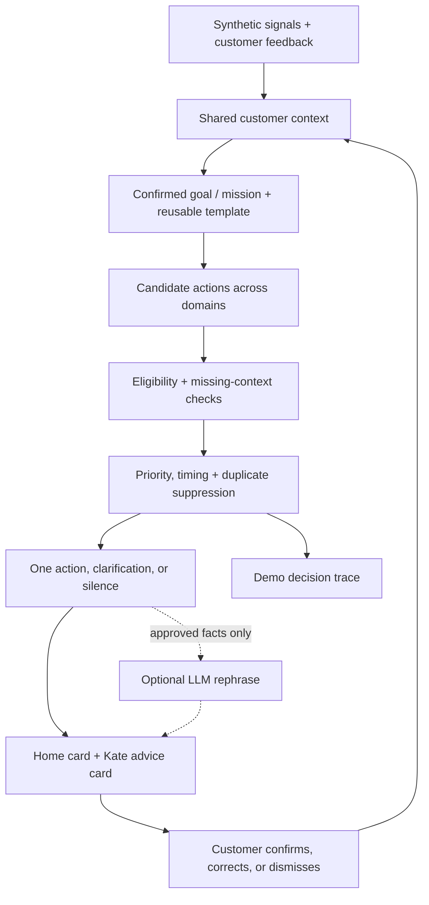

# Smart Stock — Life Goals, powered by the Moments Engine

**A proactive financial guidance concept for the Tectonic Hackathon, KBC track.**

> Set a goal. Kate helps you reach it faster — by spending smarter and putting idle cash to work — and tells you the moment it matters, or stays quiet when it doesn't.

This document proposes a **direction shift**: make the **customer's own life goal the hero** of the experience, and treat every KBC product as a *lever* that helps reach it. It builds directly on the team's existing **Moments Engine** and **Life Missions** work (`lib/types.ts`, `docs/CONTRACT.md`, `data/demo-fixtures.ts`) — it does not replace them. The **Moving mission** remains a first-class example; this proposal adds a **Saving mission** and a **spend-pattern ("leak") signal** alongside it.

> **Rules decide. AI explains. Customers stay in control.**

**Status:** proposal for team review. The repository contains concept and planning documents, shared TypeScript interfaces and six synthetic snapshots. The application and decision service are not implemented yet. Everything below describes intended behaviour, not verified capability.

---

## The shift, in one line

The current README leads with *life events* (moving, baby, business). This proposal reframes the same engine around the customer's **explicit goal** ("€2,000 for Japan by August"), and shows Kate closing the gap to that goal with two levers:

| Lever | What Kate does | Signal it runs on |
|---|---|---|
| ✂️ **Spend smarter** | Spot a recurring or above-average spend and suggest one concrete, optional swap that frees cash toward the goal. | Recurring-merchant / category-outlier pattern in synthetic transactions. |
| 📈 **Invest idle cash** | Offer an adjustable investment simulation when there is genuinely spare cash and the goal horizon fits. | The existing `explore-investment` rule / idle-cash detection. |

A **Life Mission** is then just a *kind of goal*: **Moving** is a near-term spending/planning goal; **"Save €2,000 for Japan"** is a savings goal. Both are instantiated from the same Moments Engine, the same context, the same `Snapshot`/`Action` contract.

## Why this fits the brief better

KBC asked us to *"save time and money"* and to *not think like a bank*. Leading with the customer's goal — instead of a product or even a life event — makes the value emotionally obvious: **you chose the target; Kate just gets you there sooner.** Investing and cutting leaks stop sounding like product pushes and become means to *your* end.

| Dimension | How this proposal demonstrates it |
|---|---|
| **Understand** | Combine the confirmed goal + spending patterns to see not just *how much* cash is spare, but *what it's for* and *where it's leaking*. |
| **Adapt** | The single next action changes with the goal and the month's spending — and disappears entirely when a bill is due or the buffer is thin. |
| **Scale** | "Saving toward a goal" is one reusable mission template; "Moving" is another. New missions reuse the same pipeline with their own rules. |

---

## Kate here is deliberately *not* a chatbot

A key design choice in this proposal, aligned with the team's existing "deterministic-first" stance:

- **Push-only advice, no free-text conversation.** Kate surfaces at most one advice card with quick replies (Confirm / Not now / Why this?). The customer never types free text at the model.
- **Why it matters:** no free-text input means **no prompt injection, no jailbreaks, and near-zero LLM cost** — the core experience runs with zero model calls. This is a security and cost story, not a limitation, and it removes the need for an expensive conversational-AI partnership to ship the demo.
- **The optional LLM only rephrases approved facts** into plain language. It never chooses an action, changes an amount, or invents a fact. Templates are the baseline and the fallback; the demo works fully without an API key.

This matches the existing contract: *deterministic filtering and action coordination run before any optional explanation call.*

## "Tell Once" is the customer's bio

Like a profile an assistant already knows without re-asking, the customer's durable facts — goal, amount, deadline, risk profile, "I'm already insured elsewhere", "I have a car", dietary preference — are recorded once and **reused across Home and Kate** (the team's existing **Tell Once** / **What Kate knows** panel and `CustomerContext`). Kate reads these structured fields directly; they are **not** re-sent to an LLM each turn, which keeps cost near zero and keeps facts customer-correctable and auditable.

---

## The Saving mission (new)

A customer sets a goal. Kate maintains a plan toward it and, when helpful, suggests **one** optional next step.

1. **Set the goal.** "€2,000 for a trip to Japan by August." Recorded once as intent + amount + deadline.
2. **Detect a leak (deterministic).** Over 90 days of synthetic transactions, a rule flags a recurring or above-category-average spend — e.g. *"coffee at MadMum, €4.20 × ~22/month = ~€92/month."* Each flag carries its evidence (which transactions, which rule).
3. **Suggest one swap.** Kate proposes a single, optional, respectful alternative that frees cash toward the goal, with the projected impact: *"Bringing this closer to your usual €1.10 would free ~€68/month — that's your goal reached ~3 weeks sooner."*
4. **Customer decides.** Confirm (track it as a saving intention), Not now, or Why this? Nothing is automated; no money moves.
5. **Progress updates.** The goal's progress bar and expected completion date reflect confirmed savings and any idle-cash investment.

### On price comparison — honest scope

The "where is coffee/groceries cheaper" idea (Google Maps menus, Albert Heijn prices, image recognition) is compelling but is a **hackathon trap if taken literally**: scraping Google Maps is against its terms, isn't buildable in the time we have, and re-introduces exactly the AI-black-box risk we're avoiding. For the demo, **price alternatives are synthetic fixtures** (clearly labelled), and the *swap logic* — detect pattern → compare to a benchmark → project goal impact — is the real, deterministic contribution. Real external price feeds are noted as future work requiring proper data access and customer consent, consistent with the team's stance on purchase/location signals.

## Example — Lotte's Japan goal

| | |
|---|---:|
| Goal | €2,000 by August |
| Saved so far | €650 |
| Gap | €1,350 |
| Detected leak (synthetic) | Coffee ~€92/mo vs ~€24 usual |
| If confirmed swap | +~€68/mo → **goal ~1 month sooner** |
| Idle cash available to invest | see existing `investing` fixture (€1,500 adjustable) |

Kate shows **one** card at a time — the swap *or* the investment, whichever moves the goal most right now — never both at once, and neither if a bill is due or the buffer is thin.

---

## Architecture — reuses the Moments Engine

The pipeline is unchanged. This proposal adds:

- a **`saving` action domain** alongside `planning | investing | insurance`;
- a **leak-detection rule** (e.g. `spend-pattern`) producing a `saving`-domain candidate with evidence IDs;
- a **goal-progress** view over confirmed savings + simulated investment.

### Contract impact

This is **additive** and does **not** break contract v1.0. `Action.domain` would gain `'saving'`; a new `RuleId` and `ReasonCode`s would be added; new fixtures (`saving-*`) would be introduced. Per `docs/CONTRACT.md`, any such change must be agreed with the core-engine owner and land in `lib/types.ts`, the golden fixtures and `docs/CONTRACT.md` **together**, announced in the commit. **Nothing here changes the existing Moving/investment fixtures a teammate is already building against.**

---

## Status

| Item | Status |
|---|---|
| Goals-as-hero framing + Saving mission concept | Proposed (this document) |
| Moments Engine, Life Missions, Moving mission | Documented by team; unchanged |
| Shared interfaces + six synthetic snapshots | Available in `lib/types.ts`, `data/demo-fixtures.ts` |
| `saving` domain + leak-detection rule + fixtures | Proposed; contract extension not yet agreed |
| Decision service, UI, LLM rephrase | Planned (as in existing README) |
| Real external price feeds | Future; requires data access + consent |
| Aikido audit + before/after screenshots | Not completed |

**Out of scope:** real banking data or APIs, payments or trading, real authentication, a production suitability process, live web scraping, databases, native apps, and production-scale deployment.

## Security and submission

Unchanged from the team's plan: synthetic data only, no committed secrets, deterministic logic separated from generated explanations, and a required **Aikido audit** (10% of assessment) with before/after screenshots. The push-only (no free-text) Kate design **reduces** the LLM attack surface, since the model never receives customer free text.

## Repository guide

- [AGENTS.md](AGENTS.md): coding-agent instructions.
- [docs/CHALLENGE.md](docs/CHALLENGE.md): challenge analysis.
- [docs/PLAN.md](docs/PLAN.md): MVP implementation plan.
- [docs/CONTRACT.md](docs/CONTRACT.md): canonical interface semantics.
- [docs/DESIGN.md](docs/DESIGN.md): KBC-inspired design research.

---

Hackathon concept and proposed proof of concept. Not affiliated with or endorsed by KBC. All demo customer data is synthetic. No real transaction is executed, and illustrative scenarios are not financial advice.
