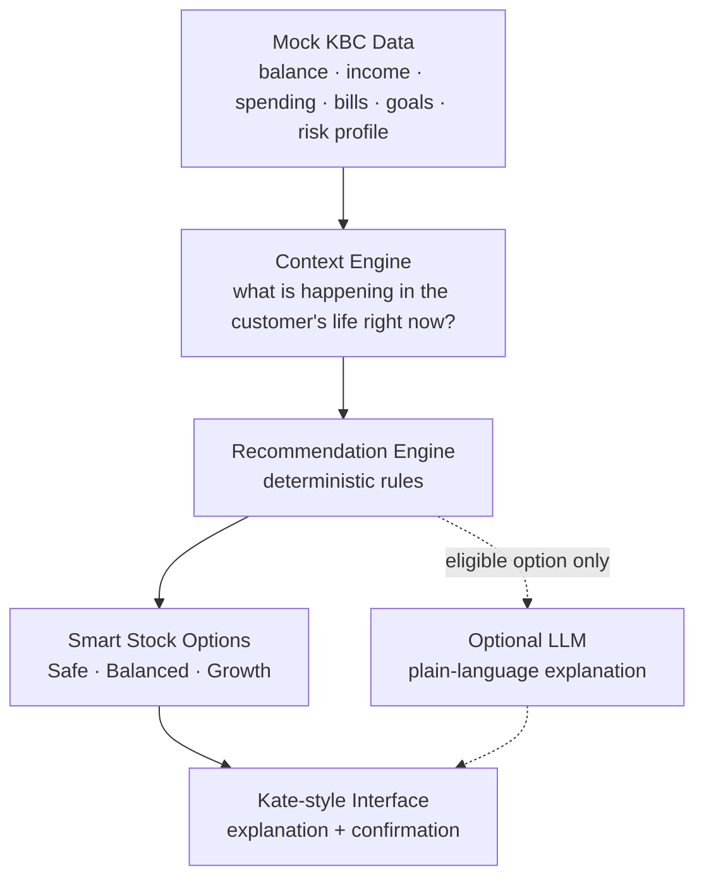

# Smart Stock

**A proactive investment assistant concept for KBC. Built for the Tectonic Hackathon (KBC track).**

> Smart Stock helps KBC understand a customer's financial situation *before* the customer asks for help.
> **From reactive banking to proactive financial guidance.**

Customers usually have to look for investment products themselves. Smart Stock works the other way around. It notices when a customer has cash they don't need right now, checks their financial situation, and then shows them a few investment options that fit.

It answers KBC's challenge: *"Imagine that KBC could understand and know what a customer wants and needs before they even ask it."* It covers all three parts of the brief: **Understand** the customer's situation, **Adapt** the experience at the right moment, and **Scale** to millions of customers.

---

## The problem

Today a customer with spare money has to do all the work:

```
Notice unused cash → Decide if it's safe to invest → Understand their risk
→ Search for products → Compare options → Take action
```

Most people stop after the first or second step. Meanwhile the money sits idle and inflation slowly eats its value. Everyone accepts this as normal.

## The idea

Smart Stock turns those six steps into a single moment:

```
Customer data → Detect excess cash → Understand context
→ Generate suitable options → Explain why → Customer confirms
```

### Our principle

> **AI explains. Rules decide. Humans confirm.**

- **Rules decide.** A deterministic, auditable engine decides whether there is spare cash and which options the customer is eligible for.
- **AI explains.** An LLM is optional and only rewrites the explanation in plain language. It never picks an investment.
- **Humans confirm.** The app suggests and the customer decides. Nothing runs without a confirmation.

---

## Example

| | |
|---|---:|
| Current balance | €7,850 |
| Emergency buffer | − €4,000 |
| Upcoming expenses (next 30 days) | − €1,000 |
| **Available cash** | **€2,850** |
| **Suggested investment** | **€1,500** |

The suggested amount is deliberately conservative: about half of the available cash, rounded. The rest stays flexible.

Kate notifies the customer proactively:

> 💬 **Kate:** You have €1,500 more available than you normally need.
> Would you like to see what you could do with it?

The customer then sees three simple options:

| | 🛡️ Safe | ⚖️ Balanced | 🚀 Growth |
|---|---|---|---|
| Risk | Low | Medium | Higher |
| Allocation | Mostly bonds / money market | Mix of bonds and equity | Mostly equity |
| Horizon | Short to medium | Medium | Long (5+ years) |

Each option explains its **risk level**, **suggested allocation**, **why it matches the customer** and **which financial goals it supports**. The option closest to the customer's risk profile is highlighted.

---

## Architecture



### 1. Mock KBC data
The prototype uses **synthetic customer data only**. Signals include account balance, income, spending, upcoming bills, emergency buffer, risk profile, investment horizon and financial goals.

### 2. Context engine
Answers one question: *what is happening in the customer's financial life right now?*

```
Available cash = Balance − Emergency buffer − Upcoming expenses
```

It decides whether there is enough spare cash to suggest investing at all. If the buffer is too thin or big bills are coming, **Kate stays quiet**. Knowing when not to nudge is part of the value.

### 3. Recommendation engine
Deliberately simple, deterministic and explainable:

| Risk profile | Recommended option |
|---|---|
| Low | Safe |
| Balanced | Balanced |
| High | Growth |

The recommendation also takes into account **investment horizon**, **liquidity** and **financial goal**. No ML model is needed for the proof of concept.

### 4. AI usage
```
Customer context → Rule-based recommendation → Eligible option → LLM explanation → Customer confirmation
```
Example explanation:
> *"Your emergency buffer and upcoming expenses remain protected, while this option matches your balanced risk profile and long-term financial goal."*

---

## User flow (MVP: 4 screens)

| # | Screen | What the customer sees |
|---|---|---|
| 1 | **Dashboard** | Kate proactively flags an opportunity: *"You have €1,500 more available than usual."* |
| 2 | **Financial context** | How the amount was calculated: balance − safety buffer − upcoming expenses = available cash |
| 3 | **Smart Stock options** | Safe / Balanced / Growth, with the closest match highlighted |
| 4 | **Explanation & confirmation** | ✓ Emergency buffer protected · ✓ Upcoming bills covered · ✓ Matches risk profile · ✓ Fits long-term goal → **Confirm simulation** |

No real investment is executed. Confirmation is simulated.

---

## Why it fits the KBC challenge

| Challenge dimension | Smart Stock |
|---|---|
| **Signals** | Transactions, balance, expenses, goals |
| **Situation** | Excess liquidity detected |
| **Intent** | Long-term financial growth |
| **Adaptation** | Personalised options, delivered at the right moment, or not at all |
| **Scale** | One reusable decision engine across products and channels |

## Beyond investing: a Next Best Action engine

Smart Stock is only the **first use case**. The same pipeline (signals → context → rules → explanation → confirmation) handles any life moment by adding one more rule:

| Signal | Next best action |
|---|---|
| Excess cash | Investment |
| New address | Home insurance |
| Flight booking | Travel insurance |
| Salary increase | Savings plan |
| Mortgage event | Financing / refinancing |

This is the real pitch. KBC is not asking for another feature. It is asking for a scalable personalisation approach for **2.5 million customers**.

---

## Tech stack

- **Next.js** + **TypeScript**
- **Tailwind CSS** (KBC-inspired design tokens, see [`kbc-design` skill](../../tree/skills/skills/kbc-design/SKILL.md))
- **JSON mock data** (synthetic customers)
- **Rule-based recommendation engine** (pure TypeScript)
- **Optional LLM**, for explanation text only. The app works fully without it.

The architecture is intentionally minimal so the team can focus on a polished end-to-end experience.

## Getting started

> ⚠️ The app is being built during the hackathon. These commands will work once the Next.js app is in `main`.

```bash
git clone https://github.com/ShayChen817/Pirates0fLeuven.git
cd Pirates0fLeuven
npm install
cp .env.example .env   # optional: add an LLM API key for explanation text
npm run dev            # open http://localhost:3000
```

| Env var | Required | Purpose |
|---|---|---|
| `ANTHROPIC_API_KEY` | No | Rewrites the explanation text. Without it, template text is used. |

## Project status

| Feature | Status |
|---|---|
| KBC-style dashboard with Kate nudge | 🚧 In progress |
| Synthetic customer profiles | 🚧 In progress |
| Context engine (excess cash detection) | 🚧 In progress |
| Safe / Balanced / Growth options | 🚧 In progress |
| Explanation (template + optional LLM) | 🚧 In progress |
| Confirmation simulation | 🚧 In progress |
| Scale story (second rule: new address → home insurance) | 🚧 In progress |

**Not built (by design):** real trading, stock price prediction, portfolio optimisation, real KBC authentication, databases, multi-agent systems, complex ML models.

---

## Security

Security is part of the official judging criteria, and the hackathon requires an **Aikido security audit**.

- ✅ Synthetic customer data only. No real or confidential customer information.
- ✅ No API keys or passwords in the repository. Secrets live in `.env`, which is gitignored; names are documented in `.env.example`.
- ✅ Deterministic financial logic. The LLM cannot change what is recommended.
- ⬜ Aikido audit run before submission (screenshots added to the submission)

## Judging criteria

| Criterion | How Smart Stock addresses it |
|---|---|
| **Creativity** | Proactive banking instead of reactive product discovery. Kate also knows when *not* to nudge. |
| **Technical ability** | A complete working flow from customer data to recommendation to confirmation |
| **Fit** | Directly addresses understanding, personalisation, timing and scalability |
| **Security** | Synthetic data, deterministic logic, no secrets in git, Aikido audit |

## Submission checklist

- [ ] Short project description
- [ ] Demo video (< 3 minutes)
- [x] Public GitHub repository
- [ ] Aikido screenshots
- [x] README with run instructions and unfinished functionality

## Repository layout

```
docs/CHALLENGE.md   challenge analysis
docs/PLAN.md        build plan, interfaces, workstreams
docs/DESIGN.md      KBC-inspired design research
AGENTS.md           instructions for coding agents
```
Shared agent skills live on the [`skills` branch](../../tree/skills/skills).

---

*Hackathon proof of concept. Not affiliated with or endorsed by KBC. All customer data is synthetic, and nothing here is financial advice.*
